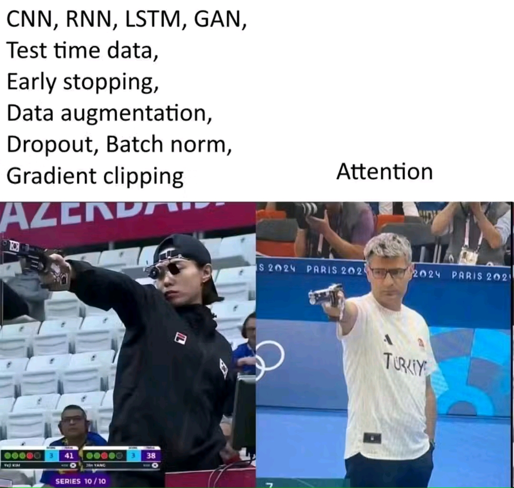

# English-French Translator with Attention Mechanism and LSTM

## Project Description
This project implements an English-to-French neural machine translation (NMT) model using Long Short-Term Memory (LSTM) networks and an attention mechanism. The model is trained to translate English sentences into French with improved accuracy by leveraging attention to focus on relevant words during translation.

## Features
- Encoder-Decoder architecture with LSTM networks
- Attention mechanism to enhance translation quality
- Preprocessing of text data (tokenization, padding, embedding)
- Training on parallel English-French sentence datasets
- Evaluation using BLEU score
- Inference mode for real-time translation

## Installation
To run this project, install the required dependencies:

```bash
pip install numpy pandas tensorflow keras nltk
```

## Dataset
The model is trained on a parallel English-French corpus. You can use publicly available datasets such as:
- Tatoeba dataset
- WMT English-French dataset
- Custom dataset with aligned sentence pairs

## Model Architecture
1. **Encoder**: Bi-directional LSTM processes input sentences.
2. **Attention Mechanism**: Assigns weights to words in the input sequence.
3. **Decoder**: LSTM generates translated words sequentially.
4. **Training**: Uses teacher forcing with categorical cross-entropy loss.
5. **Inference**: Predicts translations given unseen input sentences.

## Usage
### Training the Model
Run the following script to train the model:

```bash
python train.py
```

### Translating a Sentence
Use the following command to translate a sentence:

```python
from translator import translate
sentence = "Hello, how are you?"
translation = translate(sentence)
print("French Translation:", translation)
```

## Evaluation
The model's performance is evaluated using the BLEU (Bilingual Evaluation Understudy) score:

## Acknowledgments
- TensorFlow/Keras for deep learning implementation
- OpenAI and NLP research communities for advancements in sequence-to-sequence learning
